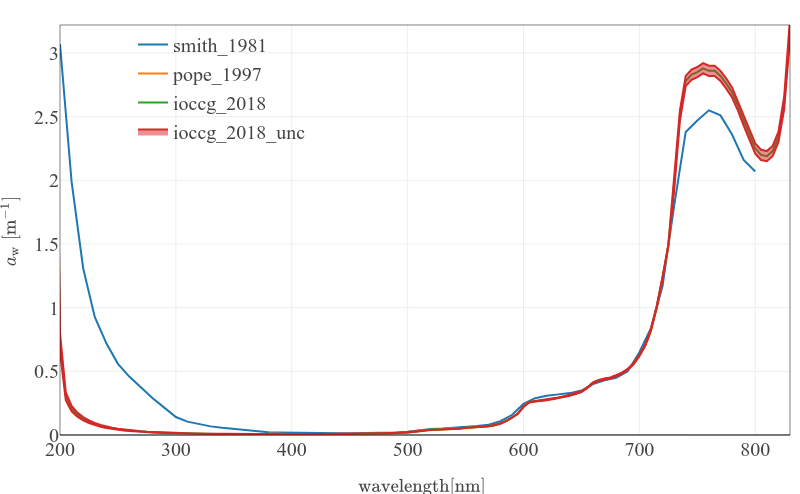

# aw

This data package contains "pure" water absorption spectrum obtained experimentally by numerous authors.

For an interactive comparison of the "pure" water absorption spectrum see vignette `aw_comparison`

This package was inspired by https://omlc.org/spectra/water/abs/index.html and most of the data comes from this transcription.
